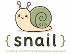

# Snail - Programming Language

Snail is a small programming language, designed for an introduction to [Abstract Interpretation](https://en.wikipedia.org/wiki/Abstract_interpretation).

## Installation

In order to install the `snail` tool, run the following commands in a terminal:

```bash
git clone https://github.com/nikolaushuber/snail.git
cd snail
uv tool install .
```

Installation instructions for `uv` can be found [here](https://docs.astral.sh/uv/).

## Syntax

Snail only has four commands: `init`, `repeat`, `either/or`, `move`. An example programs looks like this:

```
init([0.0, 1.0], [-1.0, 1.0])
repeat:
    either:
        move(-1.0, 0.0)
    or:
        move(1.0, 1.0)
```

Each program needs to start with an `init`, which places the snail at a random position within the (x, y) range given by the arguments.

The body of a `repeat` block is repeated a random number of times. 

For an `either`/`or` statement, one of the given branches is executed non-deterministically.

A `move` command moves the snail in the direction indicated by the x and y argument.

## Execution

To run a snail program you can call

```bash
snail examples/simple.snail
```

This will open a plot of the trace the snail has taken. You can run multiple traces by using the `--runs` argument:

```bash
snail examples/simple.snail --runs 10
```

Since the `repeat` statement allows for potentially infinite runs, the `snail` simulator uses an internal *fuel*, which
limits how often the body of a `repeat` statement can be executed. This is set to `10` by default, but can be adapted
with the `--fuel` argument:

```bash
snail examples/ex1.snail --runs 10 --fuel 100
```

Finally, instead of showing the simulation result in a separate window, you can save the simulation to a file:

```bash
snail examples/ex1.snail --runs 10 --fuel 100 --out output.png
```

## Gardens

You don't want snails in your gardens. To test, if a snail reaches your gardens, you can define garden areas in a separate file
and provide it to the simulator: 

```bash
snail examples/ex1.snail --runs 10 --garden examples/g1.garden
```

The format for describing gardens is simple. Each garden consists of a 4-tuple describing `origin_x, origin_y, width, height`.
See `examples/g1.garden` for an example.

And if you want your garden to be fancy, you can try:

```bash
snail examples/ex1.snail --runs 10 --garden examples/g1.garden --flowers
```

## License

MIT

## Acknowledgement

The `snail` programming language is inspired by the language used in the following book:


> Introduction to Static Analysis: An Abstract Interpretation Perspective
> Rival, X. and Yi, K.
> 2020, MIT Press
